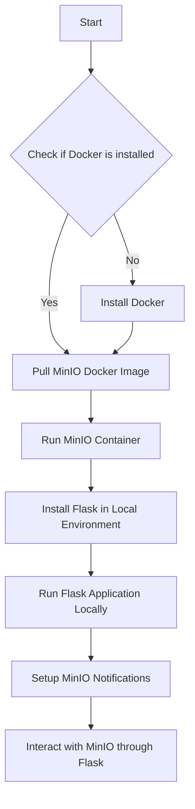
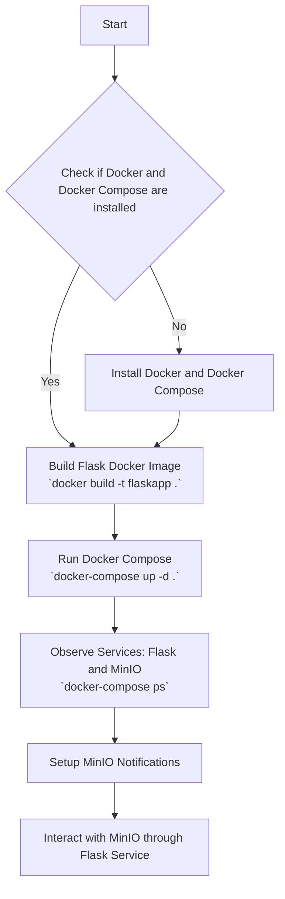

# Quick Reference for Smooth Sailing from Docker to Localhost

This README.md contains the relevant commands to preform the actions taken in Smooth Sailing from Docker to Localhost, the article demonstrates how to connect a docker container to a flask app service. 

```bash
## example of the directory structure for visualization
➜  flaskapp tree -L 2
.
├── app
│   ├── main.py
│   └── requirements.txt
├── docker-compose.yaml
└── dockerfile

2 directories, 4 files
```
## Commands to Run
```bash
## docker command to run using host's local network (replaces docker port mapping)
docker run --name minio --network="host" minio/minio server /data

## python commands to install Flask and run main script
pip install Flask
python3 main.py

## docker command to open a interactive terminal directly in the running minio bucket
docker exec -it minio /bin/sh

## minio mc commands to setup and test the event notification webhook
mc alias set myminio http://localhost:9000 <access-key> <secret-key>
mc mb myminio/mybucket
mc admin config set myminio notify_webhook:1 endpoint="http://localhost:5000/minio_event"
mc admin service restart myminio
mc event add myminio/mybucket arn:minio:sqs::1:webhook --event put
mc cp imaginary.png myminio/mybucket/

## docker compose commands to build the flask app and orchistrate the containers deployment
docker build -t flaskapp .
docker-compose up -d
```
---

# Deployment Method Diagrams

### Docker MinIO + Flask App Local: Solution Diagram (Container<=>Localhost)

---

### Docker MinIO + Docker Flask App + Compose: Solution Diagram (Container<=>Container)


